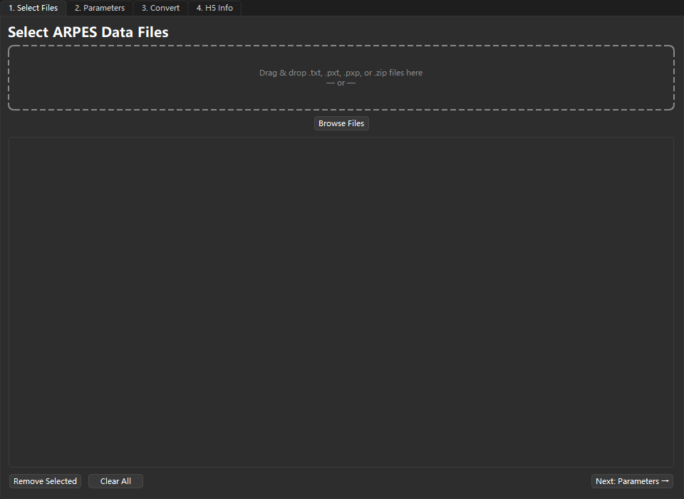
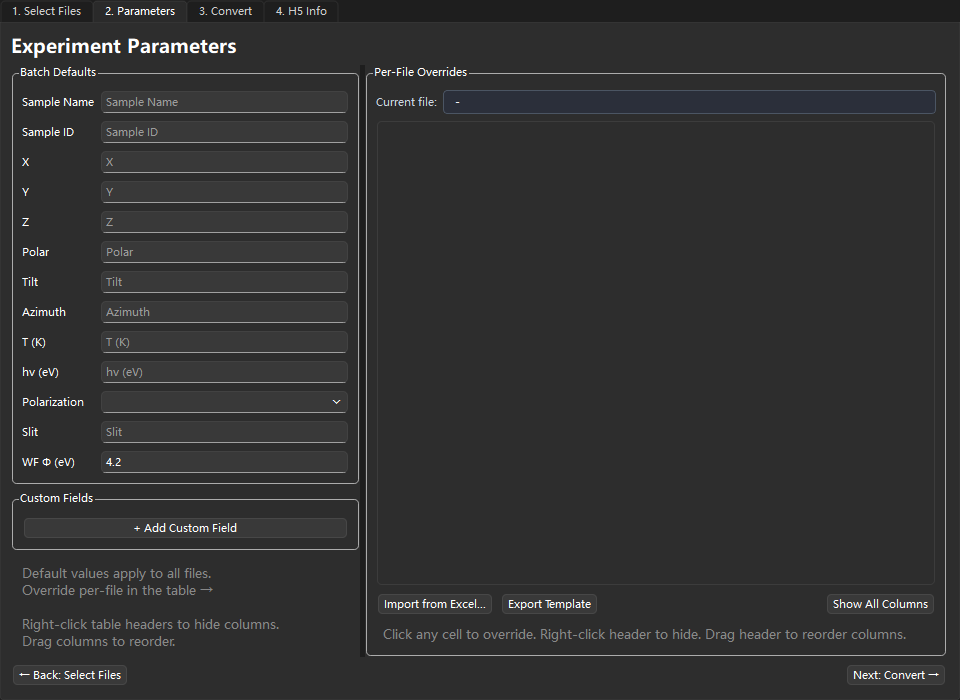
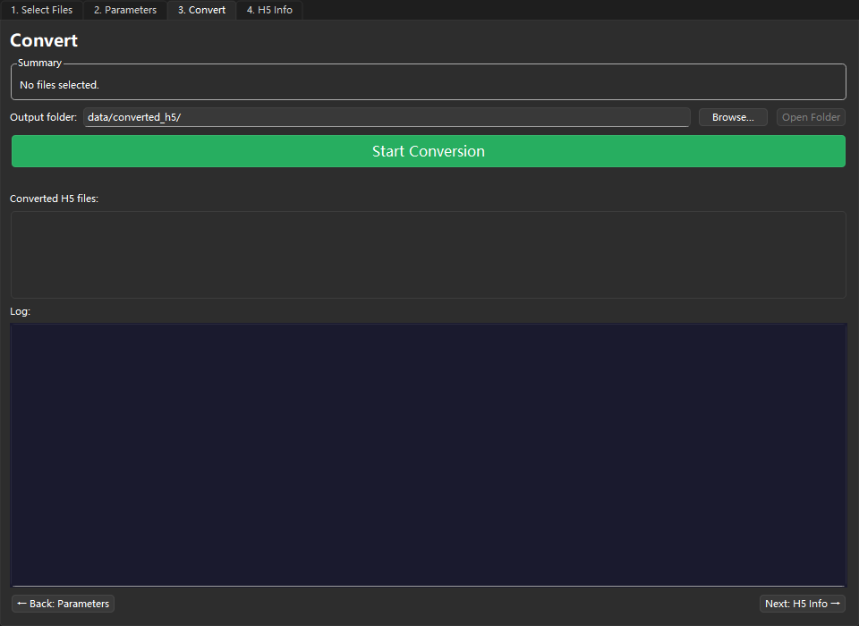
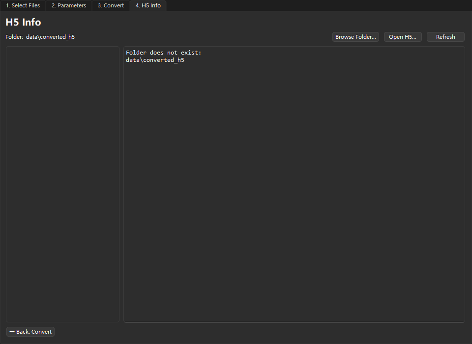

# DA30 HDF5 转换器：实验室工作流程手册

这是一个面向 Windows 桌面的 Python 3.11 PySide6 工具，用于将 ARPES / Scienta DA30 数据转换为可由 ERLab 和 xarray 读取的 HDF5 文件。

## 可用功能

- 批量选择 `.txt`、`.pxt`、`.pxp` 与 DA30 `.zip` 输入文件。
- 设置批处理默认参数、逐文件覆盖参数、自定义元数据字段，并支持 Excel 导入/导出。
- 写出符合 xarray/ERLab 约定的 HDF5 文件。
- 使用避免冲突的输出文件名。
- 在 GUI 内查看已转换 H5 文件的结构。

## 环境准备与启动

运行环境为 Windows、Conda，以及仓库中已检查入版本控制的 Python 3.11 环境定义。首次使用时创建环境；需要更新依赖时运行第二条命令：

```bat
conda env create -f environment.yml
conda env update -n convert-da30 -f environment.yml
```

使用以下可移植命令启动程序：

```bat
conda run -n convert-da30 python converter_app.py
```

`run.bat` 便于原始工作站使用，但其中写死了 `D:\Projects\convert`，并在找不到 Conda 时回退到 `D:\Anaconda` 下的环境。其他电脑请使用上面的可移植 Conda 命令，或按本机情况修改脚本中的路径。

## GUI 转换流程

### 1. `Select Files`

将支持的文件拖放到窗口中，或点击浏览选择文件；移除不需要的条目后继续。



### 2. `Parameters`

填写批处理默认值；可在每个文件对应的表格行中覆盖值，添加自定义字段，并按需使用 Excel。



### 3. `Convert`

选择输出文件夹并启动转换；在界面中查看进度和日志，完成后可打开结果文件夹。



### 4. `H5 Info`

浏览输出目录，或直接打开一个 `.h5` 文件，检查与 xarray 相关的内部结构。



## 通过 Excel 交换实验参数

按以下步骤批量准备逐文件参数：

1. 先在 `Select Files` 中选择源文件，使参数表生成对应的文件行。
2. 在 `Parameters` 页点击 `Export Template`，导出 `parameters_template.xlsx`。
3. 在工作簿中保留 `file` 或 `path` 列。
4. 填写标准参数列或自定义参数列。
5. 导入完成的 `.xlsx` 文件；与源文件匹配的行会填入逐文件覆盖参数。

代表性的标准字段包括：`sample_name`、`sample_id`、位置字段（`position_x`、`position_y`、`position_z`）、样品角度（`position_polar`、`position_tilt`、`position_azimuth`）、`temperature_K`、`photon_energy_eV`、`polarization`、`slit` 和 `work_function_eV`。

## 输入格式参考

| 格式 | 当前读取行为 |
| --- | --- |
| `.txt` | 读取 DA30 文本导出并标准化能量/角度维度。 |
| `.pxt` | 若旁边存在同名 `.txt`，优先读取该文本文件；否则使用 DA30 PXT 读取器。 |
| `.pxp` | 递归读取 IGOR experiment；多 wave 内容可能形成 `xarray.DataTree`。 |
| `.zip` | 读取含 `Spectrum_*.ini` 与 `Spectrum_*.bin` 的 DA30 导出包；多区域内容可能形成 `xarray.DataTree`。 |

可用的 PXT 参数为 `pxt_channel`（`-1` 表示自动选择）、`pxt_subtract_dark`、`pxt_energy_offset`、`pxt_energy_step`、`pxt_angle_offset` 和 `pxt_angle_step`。

## 输出行为与当前限制

- GUI 默认输出文件夹为 `data/converted_h5/`。
- 输出文件扩展名为 `.h5`，使用与 xarray 兼容的 `h5netcdf` / NetCDF4 风格存储。
- 不会覆盖已有文件：`name.h5` 已存在时会写为 `name_1.h5`，再冲突则为 `name_2.h5`。
- 单区域源通常加载为 `xarray.DataArray` 或 `xarray.Dataset`；多区域源可能加载为 `xarray.DataTree`。
- 后端保留了预览图生成代码，但当前主窗口未包含 `PreviewTab`，且 GUI 转换工作线程已禁用预览。
- 应用不会修改源数据文件。

## 故障排查

| 情况 | 处理方式 |
| --- | --- |
| `run.bat` 找不到 Conda 或 Python | 使用上面的可移植 Conda 启动命令，或修改批处理文件中的路径。 |
| `.pxt` 使用了意外的数据 | 检查其旁边是否存在同名 `.txt`；存在时程序会优先读取该文本文件。 |
| 输出文件名带有 `_1` 或 `_2` | 同名基础 H5 文件已存在；这是避免覆盖已有结果的自动命名。 |
| `.zip` 无法读取 | 确认压缩包是 DA30 导出包，并包含所需的 `Spectrum_*.ini` 与 `Spectrum_*.bin` 成员。 |
| 单独复制打包后的可执行程序无法运行 | 分发完整的 onedir 文件夹，而不是只复制可执行程序。 |

## 维护者说明

### 项目结构

```text
converter_app.py        GUI 入口
converter/              转换逻辑、HDF5/xarray I/O 与格式读取协调
converter/readers/      .txt、.pxt/.pxp、IGOR 与 DA30 .zip 读取器
gui/                    PySide6 界面及各工作流标签页
tests/                  自动化测试
data/converted_h5/      示例或生成的转换输出
build/                  PyInstaller 构建中间产物
dist/                   PyInstaller 打包输出
```

`converter/` 应保持独立于 Qt；GUI 代码应放在 `gui/`。

当前测试命令：

```bat
conda run -n convert-da30 python -m unittest discover -s tests
```

构建 Windows onedir 可执行程序：

```bat
build_exe.bat
```

输出文件为：

```text
dist\converter_app\converter_app.exe
```

请分发完整的 `dist\converter_app` 目录。`build_exe.bat` 同样包含绝对路径；在其他工作站构建前需要按本机环境调整这些路径。
